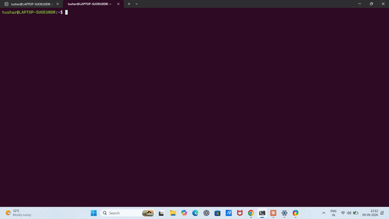

# mini-paas

A minimal, from-scratch clone of the `git push` → live deployment flow used by platforms like Heroku and Render — built to understand how PaaS systems actually work under the hood, not just how to use them.

Push code to a Git repo, and it automatically gets checked out, built into a Docker image, and launched as a running container — no manual steps in between.

---



## What this actually does (in plain English)

Normally, deploying code is a manual, fiddly process — like packing a fragile item, driving it to a store, unpacking it, and setting it up on a shelf, every single time something changes.

This project automates that entirely:

1. **It notices new code arrives** — like a mailroom that automatically opens every package the moment it's dropped off, no one has to check manually.
2. **It packs the code into a neat, self-contained box** — this is what Docker does. Think of it like a shipping container: whatever's inside, the container is a standard size and shape, so it can be lifted and run anywhere without unpacking and repacking by hand.
3. **It puts that container on a shelf and switches it on** — the app goes live, and the old version is automatically removed so nothing clutters up or clashes.

Big platforms like Heroku and Render sell exactly this experience as a service. This is a small, homemade version of the same idea — built to actually understand the machinery, not just click "Deploy."

---

## How it works

```
git push
   │
   ▼
post-receive hook fires
   │
   ▼
code is checked out 
   │
   ▼
docker build → new image
   │
   ▼
old container stopped + removed
   │
   ▼
new container is started on a port
   │
   ▼
Nginx routes a clear URL → that port
   │
   ▼
app is live at http://localhost/myapp
```

Everything after `git push` happens with zero manual intervention.


## Try it yourself

**1. Set up a bare repo (this simulates "the server"):**
```bash
mkdir -p ~/paas-server/repos
cd ~/paas-server/repos
git init --bare myapp.git
```

**2. Add the deploy hook:**
```bash
cp hooks/post-receive ~/paas-server/repos/myapp.git/hooks/post-receive
chmod +x ~/paas-server/repos/myapp.git/hooks/post-receive
```

**3. Push the example app to it (this simulates "your laptop"):**
```bash
git clone ~/paas-server/repos/myapp.git test-push
cp -r example-app/* test-push/
cd test-push
git add .
git commit -m "first deploy"
git push origin master
```

**4. Watch it deploy automatically**, then visit it:
```bash
curl http://localhost:5001
```

You should see the app respond live — deployed entirely by the hook, triggered by your push.

## Managing deployments

A small Python CLI wraps common Docker operations:

```bash
python3 paas.py list          # see all deployed apps and their status
python3 paas.py logs myapp    # view recent logs
python3 paas.py stop myapp    # stop a running app
python3 paas.py start myapp   # start it again
```

## Repo structure

```
mini-paas/
├── hooks/
│   └── post-receive       # the actual deployment engine
├── example-app/
│   ├── app.py              # a sample Flask app to deploy
│   ├── Dockerfile
│   └── requirements.txt
└── README.md
```

`hooks/post-receive` is the real project — the script that does the checkout → build → redeploy work. `example-app/` is just a sample app used to demonstrate and test it.

---

## Challenges I ran into

The trickiest bug: containers weren't being replaced on redeploy. Every new push built a fresh Docker image successfully, but the *old* container kept running, and `docker run` failed with a naming conflict.

Manually running `docker stop myapp` and `docker rm myapp` worked fine — so the problem was specific to how the hook itself ran them. Adding `set -x` to the top of the script to trace every command revealed the actual bug:

```bash
+ docker stop APP_NAME     # wrong — literal text "APP_NAME"
+ docker run ... myapp     # correct — actual value "myapp"
```

The `docker run` line correctly substituted the variable, but `docker stop`/`docker rm` were referencing the literal text `APP_NAME` instead of its value — caused by inconsistent quoting (`"$APP_NAME"` vs. an unquoted or mistyped `APP_NAME`). Fixing the quoting made the old container get found and removed correctly on every subsequent push.

Small bug, but a good reminder that in Bash, quoting isn't cosmetic — it changes whether a variable actually gets substituted at all.

---

## Roadmap

- [x] Auto-trigger on `git push` (Git hook)
- [x] Auto-checkout pushed code
- [x] Auto-build Docker image
- [x] Auto-replace running container
- [x] Python CLI to list apps, view logs, and tear down deployments
- [x] Reverse proxy (Nginx) for clean URLs instead of raw ports
- [ ] Support multiple apps at once, not just one hardcoded app name

---

## Current limitations

This is a proof-of-concept, not a production system. Known constraints:

- Single app only — app name, port, and Nginx route are currently hardcoded, so only one app can be deployed at a time.
- No dynamic port allocation — a real multi-app version would need to assign each app its own port automatically.
- No remote push support — deploying requires direct access to the server's bare repo (no SSH key management or auth layer yet).
- Any pushed app must include its own Dockerfile — the engine is language-agnostic, but relies entirely on Docker to know how to build and run the code.

**Possible next steps:** dynamic app-name/port detection, auto-generated Nginx routes per app, and SSH-based push access for multiple users.


Built as a learning project while studying DevOps fundamentals — Linux, shell scripting, Git internals, and Docker.
